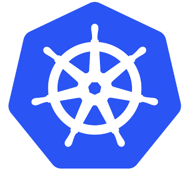

# SQL Server & Kubernetes

---

## Andrew Pruski

### SQL Server DBA & Microsoft Data Platform MVP

@fa[twitter] @dbafromthecold  
@fa[envelope] dbafromthecold@gmail.com  
@fa[wordpress] www.dbafromthecold.com  
@fa[github] github.com/dbafromthecold

---

### Session Aim

To give you background knowledge (and code) to get started with Kubernetes

---

## Kubernetes

 
@size[0.9em](Open source orchestration engine)  
@size[0.9em](Designed by Google)  
@size[0.9em](Hosted by the Cloud Native Computing Foundation)  
@size[0.9em](Kubernetes v1.0 was released on July 21, 2015)

---

  

---

## Why learn Kubernetes?

Leading orchestrator 
Easy to deploy and mantain containers 
Quick to spin up containers 
High availability build in

---

## Getting Started

Minikube 
Docker for Desktop 
Visual Studio Code

---

# Demo

---

## Master

Components for controlling the cluster 
kube-apiserver 
etcd 
kube-scheduler 
kube-controller-manager 
cloud-controller-manager 

---

## Nodes

Running and maintaining pods 
kubelet 
kube-proxy 
Docker

---

## Pods

Group of one or more containers 
Shared storage/network 
Specification for how to run the containers

---

## Services

An abstraction over a set of pods 
Provides a stable networking endpoint 
Different types: - 
ClusterIp 
NodePort 
LoadBalancer 
External Name

---

## Deployments

Declarative rather than procedural 
Desired state defined 
Pushed to cluster via kubectl 
Reconciliation loop compares desired state vs running state

---?code=assets/code/deployment_yaml_file.yaml&lang=yaml&title=Deployment yaml file

@[3-6](Metadata of deployment)
@[8](Number of replicas)
@[13-23](Pod declaration)
@[15](Pod name)
@[16](Image to be used)
@[17-18](Port on pod)
@[19-23](Setting environment variables)
@[24-35](Service)
@[26-27](Metadata)
@[29-32](Port on service to port on pod)
@[33-35](Selector)
@[35](External IP address)

---

# Demo

---

## Persisting data

Same issue with Docker containers 
Data changes not on a persistent volume will be lost

---

## Persistent Volumes

Just a piece of storage in the cluster 
Described by storage classes 
Can be either dynamic or static

---

## Persistent Volume Claims

Request for storage by a user 
Request for size and access type 
PVC is attached to a pod

---

# Demo

---

## Cloud Providers

Azure Kubernetes Service 
Amazon Elastic Container Service for Kubernetes 
Google Kubernetes Service

---

## Resources

https://github.com/dbafromthecold/SQLServerAndKubernetes 
https://dbafromthecold.com/2017/03/15/summary-of-my-container-series/
