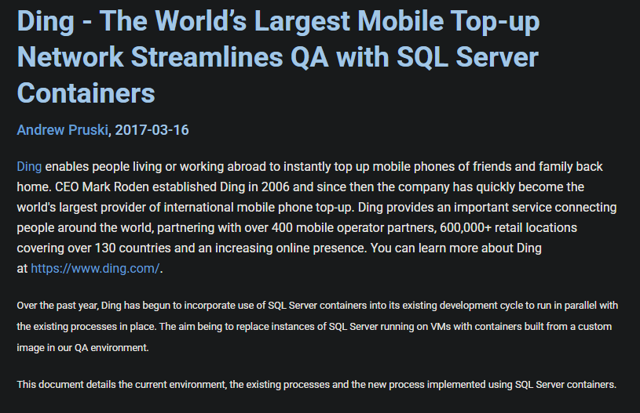

# SQL Server & Kubernetes

---

## Andrew Pruski

### Principal Field Solutions Architect
#### Microsoft Data Platform MVP
#### Docker Captain
#### VMware vExpert

<!-- .slide: style="text-align: left;"> -->
<i class="fa-brands fa-bluesky"></i><a href="https://bsky.app/profile/dbafromthecold.com">  @dbafromthecold.com</a> 
<i class="fas fa-envelope"></i>  dbafromthecold@gmail.com 
<i class="fab fa-wordpress"></i>  www.dbafromthecold.com 
<i class="fab fa-github"></i><a href="https://github.com/dbafromthecold">  github.com/dbafromthecold</a>

---

## Session Aim
<!-- .slide: style="text-align: left;"> -->
To give you background knowledge (and code) to run SQL Server on Kubernetes

---

## Agenda
<!-- .slide: style="text-align: left;"> -->
- Why run SQL Server on Kubernetes?
- How to run SQL Server on Kubernetes
- Persisting data
- High availability

---

  

---

# Background

---

## Challenges for stateful applications
<!-- .slide: style="text-align: left;"> -->
- Containers are ephemeral by default
- Provisioning storage can tie an application to a host
- High availability & Disaster Recovery
- Noisy neighbours

---

## Why run SQL Server on Kubernetes?
<!-- .slide: style="text-align: left;"> -->

- Quickly provision
- Custom images
- Built-in High Availability
- Centralise instances

---

<!-- .slide: style="text-align: left;"> -->

  

<a href="https://www.sqlservercentral.com/articles/ding-the-world%E2%80%99s-largest-mobile-top-up-network-streamlines-qa-with-sql-server-containers">https://www.sqlservercentral.com/articles/ding-the-world's-largest-mobile-top-up-network-streamlines-qa-with-sql-server-containers</a> 

---

## SQL Server on Linux
<!-- .slide: style="text-align: left;"> -->

  

---

## SQL Server on Linux
<!-- .slide: style="text-align: left;"> -->
- Released in 2017
- Achieved via the Platform Abstraction Layer (SQLPAL)
- Prevented significant codebase changes
- Has all SQL core engine features
- Only supported option for containers/kubernetes

---

## Deployments vs Statefulsets
<!-- .slide: style="text-align: left;"> -->
<ul>
<li class="fragment">Technically either</li>
<li class="fragment">Only one pod running</li>
<li class="fragment">Realistically Statefulsets</li>
    <ul>
        <li class="fragment">Stable, Unique Network Identities</li>
        <li class="fragment">Graceful Pod Termination & Recreation</li>
        <li class="fragment">Reference PVCs with manifest</li>
    </ul>
</ul>

---

## Persisting data
<!-- .slide: style="text-align: left;"> -->

- Lifecycle independent
- Follow SQL Server best practices
- Potential for snapshotting?
- Backups are still required!

---

## Access Modes
<!-- .slide: style="text-align: left;"> -->
Only one SQL instance can access a database!
<ul>
<li class="fragment">ReadOnlyMany</li>
<li class="fragment">ReadWriteMany</li>
<li class="fragment">ReadWriteOnce</li>
<li class="fragment">ReadWriteOncePod</li>
<ul>

---

## SA Password
<!-- .slide: style="text-align: left;"> -->

- Sysadmin account in SQL Server
- Set via an environment variable

<pre><code>apiVersion: v1
kind: Secret
metadata:
  name: mssql-sa-password
type: Opaque
stringData:
  MSSQL_SA_PASSWORD: Testing1122
</pre></code>

---

## Example Statefulset
<!-- .slide: style="text-align: left;"> -->

<pre><code data-line-numbers="*|17-18|21|22-24|25-33|34-40|41-47|48-57|52-53|57">apiVersion: apps/v1
kind: StatefulSet
metadata:
  name: mssql-statefulset
spec:
  serviceName: "mssql"
  replicas: 1
  podManagementPolicy: Parallel
  selector:
    matchLabels:
      name: mssql-pod
  template:
    metadata:
      labels:
        name: mssql-pod
    spec:
      securityContext:
        fsGroup: 10001
      containers:
        - name: mssql-container
          image: mcr.microsoft.com/mssql/server:2022-CU16-ubuntu-20.04
          ports:
            - containerPort: 1433
              name: mssql-port
          env:
            - name: MSSQL_PID
              value: "Developer"
            - name: ACCEPT_EULA
              value: "Y"
            - name: MSSQL_AGENT_ENABLED
              value: "1"
            - name: MSSQL_SA_PASSWORD
              value: "Testing1122"
          resources:
            requests:
              memory: "1024Mi"
              cpu: "500m"
            limits:
              memory: "2048Mi"
              cpu: "2000m"
          volumeMounts:
            - name: sqlsystem
              mountPath: /var/opt/mssql
            - name: sqldata
              mountPath: /opt/sqlserver/data
            - name: sqllog
              mountPath: /opt/sqlserver/log
  volumeClaimTemplates:
    - metadata:
        name: sqlsystem
      spec:
        accessModes:
         - ReadWriteOncePod
        resources:
          requests:
            storage: 25Gi
        storageClassName: mssql-sc
    - metadata:
        name: sqldata
      spec:
        accessModes:
         - ReadWriteOncePod
        resources:
          requests:
            storage: 25Gi
        storageClassName: mssql-sc
    - metadata:
        name: sqllog
      spec:
        accessModes:
         - ReadWriteOncePod
        resources:
          requests:
            storage: 25Gi
        storageClassName: mssql-sc
</pre></code>

---

# High Availability

---

## Pod Tolerations
<!-- .slide: style="text-align: left;"> -->
- No SQL Server native HA solutions
- Control how pods response when a node goes down
- Default is 5 minutes!

---

## Example Tolerations
<!-- .slide: style="text-align: left;"> -->

<pre><code data-line-numbers="*|2-5|6-9">tolerations:
- key: "node.kubernetes.io/unreachable"
  operator: "Exists"
  effect: "NoExecute"
  tolerationSeconds: 10
- key: "node.kubernetes.io/not-ready"
  operator: "Exists"
  effect: "NoExecute"
  tolerationSeconds: 10
</pre></code>

---

## Always On Availability Groups
<!-- .slide: style="text-align: left;"> -->

  

  

---

# Demo

---

## Resources
<!-- .slide: style="text-align: left;"> -->

<a href="https://github.com/dbafromthecold/SQLServerAndKubernetes">https://github.com/dbafromthecold/SQLServerAndKubernetes</a> 

  

